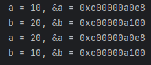
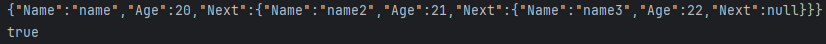

# Golang 後端工程師筆試題目

## 題目一

請模擬流水線, 五個員工處理三種物品

1. 三種物品處理時間需不一樣
2. 物品的處理順序請隨機打亂
3. 物品處理需透過 interface 來傳遞
4. 每個員工一次只能處理一種物品
5. 開始以及結束處理都需要打印紀錄
6. 統計總處理時間, 及每個員工處理了多少物品

## 題目二

請完成 swap 函式, 交換兩個變數的值

1. 允許panic但必須是顯式調用
2. 地址不允許改變

### 範例

## 題目三

請完成 TrimAllStrings 函式, 移除所有空白字元

### 範例

